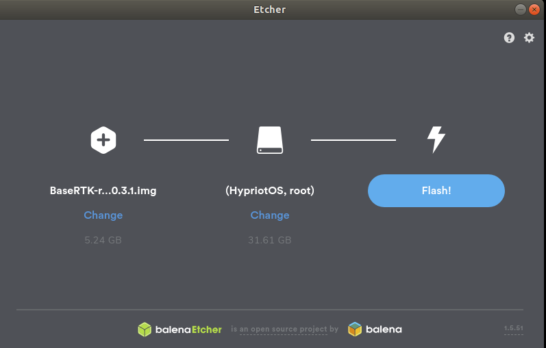

## 3.1 Installation

> Installation avec Raspberry Pi [3](https://www.kubii.fr/les-cartes-raspberry-pi/2119-raspberry-pi-3-modele-b-1-gb-kubii-713179640259.html), [4](https://www.kubii.fr/les-cartes-raspberry-pi/2770-nouveau-raspberry-pi-4-modele-b-1gb-kubii-0765756931168.html) ou [Zero W](https://www.kubii.fr/les-cartes-raspberry-pi/1851-raspberry-pi-zero-w-kubii-3272496006997.html)

### Update du firmware de l'antenne

Dans un premier temps il est nécessaire de mettre à jour le [firmware](https://fr.wikipedia.org/wiki/Firmware) de votre module F9P

* [Install U-center](https://www.u-blox.com/en/product/u-center) (Windows seulement)

* [Update F9P firmware](https://drotek.gitbook.io/rtk-f9p-positioning-solutions/tutorials/updating-zed-f9p-firmware)

* Télécharger l'image de Base RTK sur votre ordinateur (680Mo):

 [BaseRTK-rpi-V0_4_1.img.zip](https://github.com/jancelin/rtkbase/releases/download/BaseRTK-rpi-V0.4/BaseRTK-rpi-V0_4_1.img.zip)


> Ne pas copier directement l'image BaseRTK-rpi-VX_X_X.img.zip sur la carte micro SD !!!

> source:
> https://github.com/jancelin/rtkbase/releases
> https://github.com/jancelin/image-builder-rpi/tree/BaseRTK_v0.4.0

* Télécharger et installer ETCHER sur votre ordinateur (windows, linux, mac). Ce programme va permettre d'installer correctement l'image BaseRTK téléchargée dans la carte micro SD: https://etcher.io/
* Insérer la carte Micro SD dans l'ordinateur 


* Démarrer le programme Etcher, choisir l'image téléchargée, la carte SD (normalement déjà sélectionnée) et flasher la carte




### Personnaliser son installation et activation du WIFI

* Sortir et remettre la carte SD dans l'ordinateur.
* Dans votre explorateur de fichier, accéder et ouvrir le fichier **```./HypriotOS/user-data```** avec un editeur de texte.
* Pour activer le WIFI, dans le cas où votre base n'est pas en ethernet:
   * Remplacer **tout** le contenu du fichier par [celui-ci](https://raw.githubusercontent.com/jancelin/rtkbase/0.3.1/install/wifi-user-data.yml) par un copier/coller.
   * Modifier les lignes 61 et 62 avec vos paramètres

```
      ssid="NOM_DU_WIFI"
      psk="MotDePasseWifi"
```
   * Enregistrer
> attention à bien conserver les **```"```** et ne pas modifier les espaces avant les paramètres (c'est un .yml : une erreur de ce type et le fichier ne fonctionnerait pas au premier démarrage).
* Vous pouvez également personnaliser d'autres paramètres ( mot de passe, nom de session, nom de la connexion,...) afin de garantir la sécurité de votre Base RTK.
* Retirer la carte SD du PC

### Assemblage et premier démarrage

* Brancher un câble ethernet sur votre réseau afin que votre base puisse envoyer ses données au caster Centipede. (sauf si la connexion en WIFI)
* Connecter en USB le recepteur F9P.
* Insérer la carte micro SD dans le Raspberry Pi et le mettre sous tension. 
> Il est possible de connecter un écran en HDMI sur le raspberry pour visualiser le déroulement de l'installation. 
* les leds du raspberry s'allument et/ou clignotent pendant ce premier démarrage (démarrage des services).
Quand l'une d'elles s'éteint définitivement (attention à ne pas confondre avec certaines petites coupures) l'installation est terminée (env. 3 min ou plus).


* sur un PC connecté au même réseau, ouvrir un navigateur Internet et accéder à l'interface de la base RTK via l'URL :

 **http://centipede.local:8000**


Passons enfin au [paramétrage](./5_Param%C3%A9trage).

---------------------------------------------------------------------------------------------------

> ### Option : Connexion en ssh pour les développeurs ou le débugage

> ssh centipede@centipede.local

> mdp: centipede

