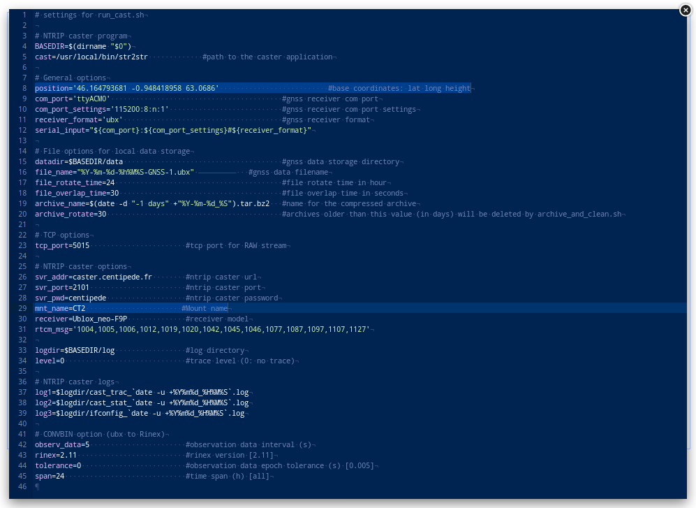

## Interface

La connexion initiale sur http://centipede.local:8000 affiche un explorateur de fichiers, à la racine du système : **```./```**


Le dossier **```./rtkbase```** regroupe l'ensemble des programmes et fichiers de données liés à la base RTK. En conséquence, toujours se placer dans le dossier **```/rtkbase```** pour exécuter les commmandes.
Pour remonter d'un niveau dans l'arborescence, double-cliquer sur **```..```** en haut du dossier.


## Données

La Base produit par défaut un flux de données RTCM3 vers le caster Centipede et des fichiers de log (.ubx) permettant entre autre de calculer sa position. Les données sont disponibles dans le dossier **```./rtkbase/data```**


Les fichiers **```*.ubx```** et **```*.ubx.tag```** sont des fichiers de log en cours d'acquisition (24h), ils vont permettre de calculer la position de la base. Toutes les nuits à 4h du matin les logs **```*.ubx```** et **```*.ubx.tag```** sont compressés en **```*-UBX.zip```** mais également convertis en **```*-RINEX_XX-5s-24h.zip```**.

## Commandes

Les commandes permettent d'effectuer des actions sur la Base RTK, comme vérifier si elle fonctionne, arrêter ou démarrer des services, mettre à jour, redémarrer...


* cliquez sur F2 

    - 1 - [RTK receiver ON](https://manpages.debian.org/unstable/rtklib/rtkrcv.1.en.html) permet de déterminer sa position (mode Rover), plus d'information [ici](https://github.com/jancelin/rtkbase/wiki/4.-Utilisation#utiliser-ce-montage-pour-faire-un-rover)
    - 2 - RTK receiver OFF arrête de mode rover.
    - 3 - Make Rinex Files : exporte les .ubx et crée des fichiers Rinex à partir de Log (.ubx) pour calculer la position (lat long alt). Toutes les données sont dans **```/data```**
    - 4 - List services : affichage de l'état des services tcp, file et ntrip.
    - 5 - Start RTCM3 : démarrage du service ntrip pour envoyer les données rtcm3 au lanceur. 
    - 6 - Stop RTCM3 : arrêt du service ntrip.
    - 7 - Start Log : démarrage du service de journalisation pour sauvegarder les données.ubx
    - 8 - Stop Log : arrêt de la journalisation
    - A - Start BT : démarre le bluetooth
    - B - Stop Bluetooth: Arrête le bluetooth
    - C - Update system : mise à jour du système (git pull)
    - D - Update receiver :  avant d'aller dans /receiver_cfg. Mise à jour des paramètres de l'antenne GNSS[F9P](https://github.com/jancelin/rtkbase/blob/master/receiver_cfg/U-Blox_ZED-F9P_config_info.txt) pour obtenir une station de base RTK
    - E - Reboot : redémarre le raspberry Pi suite à une mise à jour ou un changement de paramètres (settings.conf)

## Installation initiale

> [Avant toute chose vérifier que:](https://github.com/jancelin/rtkbase/wiki/2.-Installation)
> * l'antenne D910 et bien connectée au module F9P
> * que le [firmware du module F9P ait été updaté](https://github.com/jancelin/rtkbase/wiki/2.-Installation#update-du-firmware-de-lantenne),
> * le module F9P est bien connecté en USB au Raspberry Pi,
> * le Raspberry Pi est bien connecté à votre réseau et au web (port 8000, 2101 et 22 ouverts) via un câble ethernet (RJ45) ou le wifi
> * la carte MicroSD à bien été flashée et est bien insérée dans le raspberry Pi
> * le Rasberry Pi est sous tension

1. Sur un Pc connecté au même réseau que la Base RTK, ouvrir un navigateur web ([firefox](https://www.mozilla.org/fr/firefox/new/)) et rejoindre l'adresse http://centipede.local:8000
2. Se placer dans le répertoire **```./rtkbase```**
3. Mettre à jour le système informatique de la base: **```F2 > Update system```** puis **```F2 > Reboot```**, attendre que le rédemarrage s'effectue (env 1min), appuyer ensuite sur la croix pour sortir.


Cliquez sur **```F2 > "update receiver"```**


Attendre jusqu'à la fin de la précédure et sortir. 


5. Modifier les paramètres de position et le nom de la base dans le fichier **```./rtkbase/settings.conf```**. 
    * cliquer avec le bouton droit de la souris sur le fichier **```settings.conf```** **```> Edit```**
    * changer **```position='45.999381 -1.213787 50'```** par une position approximative de l'antenne ('lat long height') grâce à l'[option rover de la base](https://github.com/jancelin/rtkbase/wiki/4.-Utilisation#utiliser-ce-montage-pour-faire-un-rover), le calcul précis de la position sera effectué ultérieurement.
    * changer **```mnt_name```** ex : **```mnt_name=FOOO```** C'est le nom de votre Base RTK, à vous de choisir 4-5 caractères en Majuscule.
    * faire un **```ctrl s```** pour enregistrer ou cliquer sur la **```X```** en haut à droite pour fermer et acceptez les modifications.


6. **```F2 > Reboot```**, attendre que le rédemarrage s'effectue (env 1min)
7. Aller dans le répertoire **```./rtkbase/data```** pour vérifier que les journaux d'actualités sont en cours d'écriture (refresh), vous pouvez supprimer tous les fichiers sauf les 2 plus récents.


8. Attendre 24h entières soit 1 journée complète (de 00:01:00 à 23:59:00), tous les jours à 04h du matin une compression des fichiers du jour précédent est effectuée.
9. Aller dans le répertoire **```./rtkbase/data```** et télécharger sur votre pc le dernier 0000-00-00-0000-GNSS-1-UBX.zip (clic droit > Download ). Conserver ce fichier afin de garantir et justifier votre calcul de postionnement.


10. Créer un répertoire ```./positionBaseRTK``` **sur votre PC** et décompresser le fichier téléchargé (0000-00-00-00-00-0000-GNSS-1-UBX.zip) dedans.
11. Utiliser cette [**procédure pour calculer la position**](https://github.com/jancelin/centipede/blob/master/docs/4_positionnement.md#43-r%C3%A9cup%C3%A9rer-les-donn%C3%A9es-du-rgp)
12. Changer **```position='45.999381 -1.213787 50'```** par la position précise calculée précédemment EX:**```position='46.164793681 -0.948418958 63.0686'```**. Vérifier une dernière fois que **```mnt_name=```** comporte bien le nom de votre base RTK. 



13. Cliquer sur **```F2 > Stop RTCM3```** & **```F2 > StartRTCM3```** pour mettre à jour les modifications.


14. Vérifier la connexion :
    * ser rendre dans le dossier **```/rtkbase/rover/Test_Base2caster```**
    * clic droit sur le fichier `**```rtkrcv.conf```** > **```Edit```**
    * Modifier > modifier ligne 106 : **```:@caster.centipede.fr:2101/BASE:```** par la vôtre ex : **```@caster.centipede.fr:2101/FOOO:```**
    * **```ctrl s```** (enregistrer)


15. Cliquez sur F2 > **```RTK reveiver ON```**


16. Tapper **```status 1```** Entrer & Vérifier que vous avez des valeurs. 

ex :

 

Vous pouvez taper **```help```** pour accéder à l'ensemble de commandes possibles ( **```satellite```** **```observ```** **```stream```** ...)

17. Si l'étape précédente est OK alors votre base GNSS RTK fonctionne bien avec le [caster Centipede](http://caster.centipede.fr:2101).
18. Pour sortir taper: **```shutdown```** puis entrée.
19. Enfin, envoyer un courriel à contact@centipede.fr pour activer votre base sur la [Carte](https://centipede.fr):
    * Nom Prénom
    * Profession
    * Courriel
    * Nom du point
    * Matériel utilisé.
