## Interface

La connexion initiale sur http://centipede.local:8000 affiche un explorateur de fichiers, à la racine du système : **```./```**

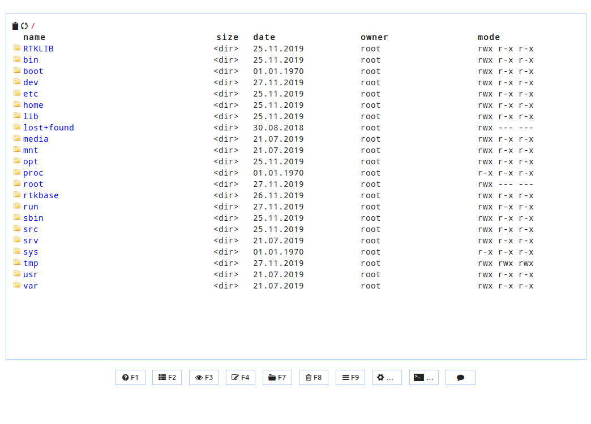

Le dossier **```./rtkbase```** regroupe l'ensemble des programmes et fichiers de données liés à la base RTK. En conséquence, toujours se placer dans le dossier **```/rtkbase```** pour exécuter les commmandes.
Pour remonter d'un niveau dans l'arborescence, double-cliquer sur **```..```** en haut du dossier.

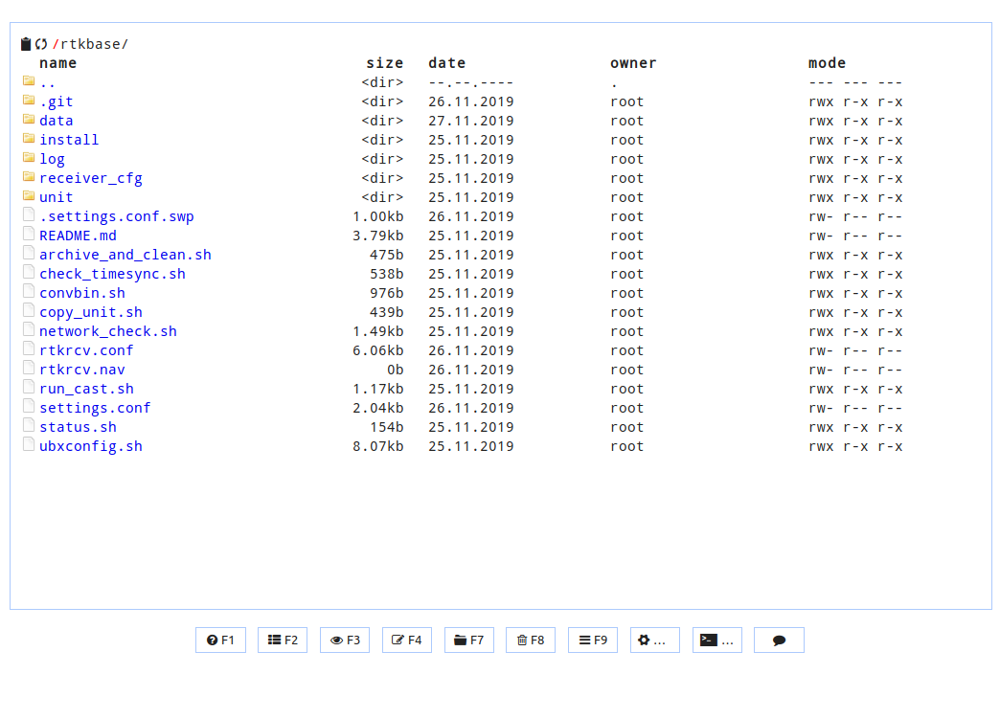

## Données

La Base produit par défaut un flux de données RTCM3 vers le caster Centipede et des fichiers de log (.ubx) permettant entre autre de calculer sa position. Les données sont disponibles dans le dossier **```./rtkbase/data```**

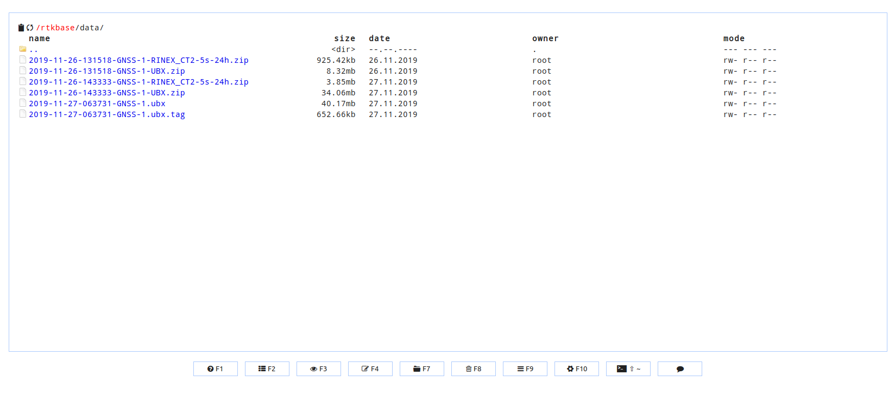

Les fichiers **```*.ubx```** et **```*.ubx.tag```** sont des fichiers de log en cours d'acquisition (24h), ils vont permettre de calculer la position de la base. Toutes les nuits à 4h du matin les logs **```*.ubx```** et **```*.ubx.tag```** sont compressés en **```*-UBX.zip```** mais également convertis en **```*-RINEX_XX-5s-24h.zip```**.

## Commandes

Les commandes permettent d'effectuer des actions sur la Base RTK, comme vérifier si elle fonctionne, arrêter ou démarrer des services, mettre à jour, redémarrer...

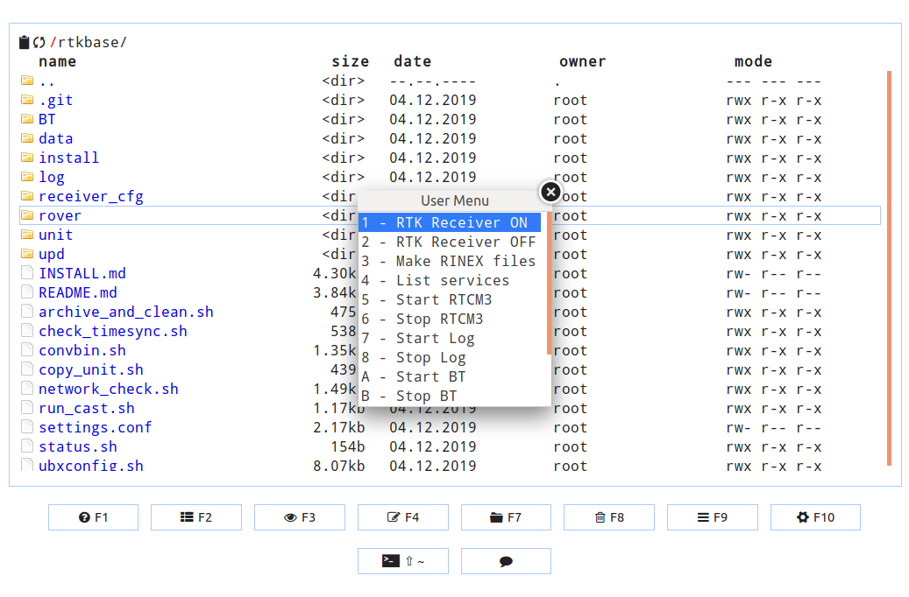

* cliquez sur F2 

    - 1 - [RTK receiver ON](https://manpages.debian.org/unstable/rtklib/rtkrcv.1.en.html) permet de déterminer sa position (mode Rover), plus d'information [ici](https://github.com/jancelin/rtkbase/wiki/4.-Utilisation#utiliser-ce-montage-pour-faire-un-rover)
    - 2 - RTK receiver OFF arrête de mode rover.
    - 3 - Make Rinex Files : exporte les .ubx et crée des fichiers Rinex à partir de Log (.ubx) pour calculer la position (lat long alt). Toutes les données sont dans **```/data```**
    - 4 - List services : affichage de l'état des services tcp, file et ntrip.
    - 5 - Start RTCM3 : démarrage du service ntrip pour envoyer les données rtcm3 au lanceur. 
    - 6 - Stop RTCM3 : arrêt du service ntrip.
    - 7 - Start Log : démarrage du service de journalisation pour sauvegarder les données.ubx
    - 8 - Stop Log : arrêt de la journalisation
    - A - Start BT : démarre le bluetooth
    - B - Stop Bluetooth: Arrête le bluetooth
    - C - Update system : mise à jour du système (git pull)
    - D - Update receiver :  avant d'aller dans /receiver_cfg. Mise à jour des paramètres de l'antenne GNSS[F9P](https://github.com/jancelin/rtkbase/blob/master/receiver_cfg/U-Blox_ZED-F9P_config_info.txt) pour obtenir une station de base RTK
    - E - Reboot : redémarre le raspberry Pi suite à une mise à jour ou un changement de paramètres (settings.conf)

## Installation initiale

### update logiciel et paramétrage automatique de l'antenne

> [Avant toute chose vérifier que:](https://github.com/jancelin/rtkbase/wiki/2.-Installation)
> * l'antenne D910 et bien connectée au module F9P
> * que le [firmware du module F9P ait été updaté](https://github.com/jancelin/rtkbase/wiki/2.-Installation#update-du-firmware-de-lantenne),
> * le module F9P est bien connecté en USB au Raspberry Pi,
> * le Raspberry Pi est bien connecté à votre réseau et au web (port 8000, 2101 et 22 ouverts) via un câble ethernet (RJ45) ou le wifi
> * la carte MicroSD à bien été flashée et est bien insérée dans le raspberry Pi
> * le Rasberry Pi est sous tension

* Sur un Pc connecté au même réseau que la Base RTK, ouvrir un navigateur web ([firefox](https://www.mozilla.org/fr/firefox/new/)) et rejoindre l'adresse http://centipede.local:8000
## 05 Paramétrage

* Se placer dans le répertoire **```./rtkbase```**
* Mettre à jour le système informatique de la base: **```F2 > Update system```** puis **```F2 > Reboot```**, appuyer ensuite sur la croix pour sortir. Attendre que le rédemarrage s'effectue (env 1-2min) et frafraichir la page web (F5)

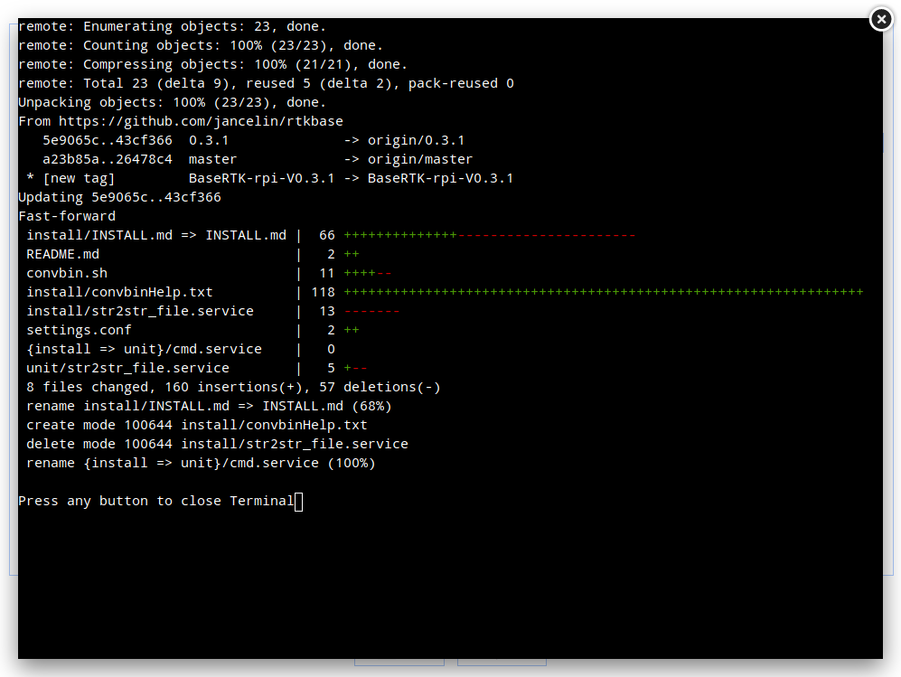

* Cliquez sur **```F2 > "update receiver"```** pour lancer le paramétrage automatique de l'antenne

> Il est possible qu'un message s'affiche plusieur fois, c'est un bug connu, **attendre surtout** la procédure s'enclenchera enssuite.

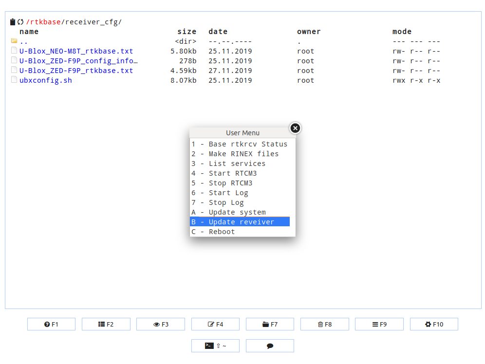

Attendre jusqu'à la fin de la précédure et sortir. 

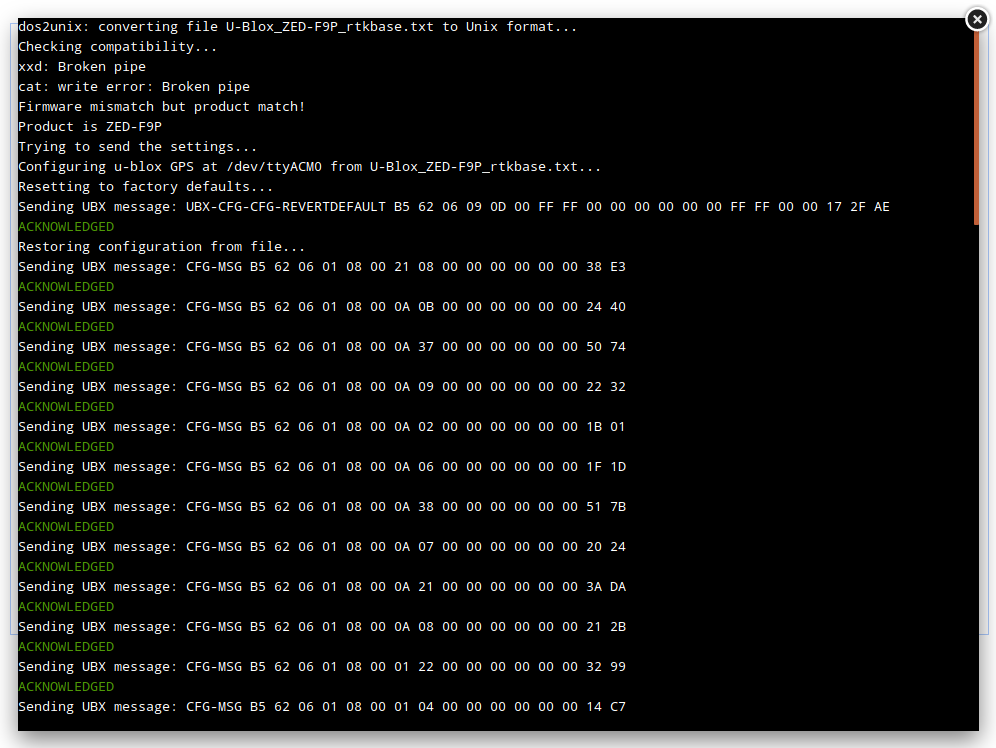
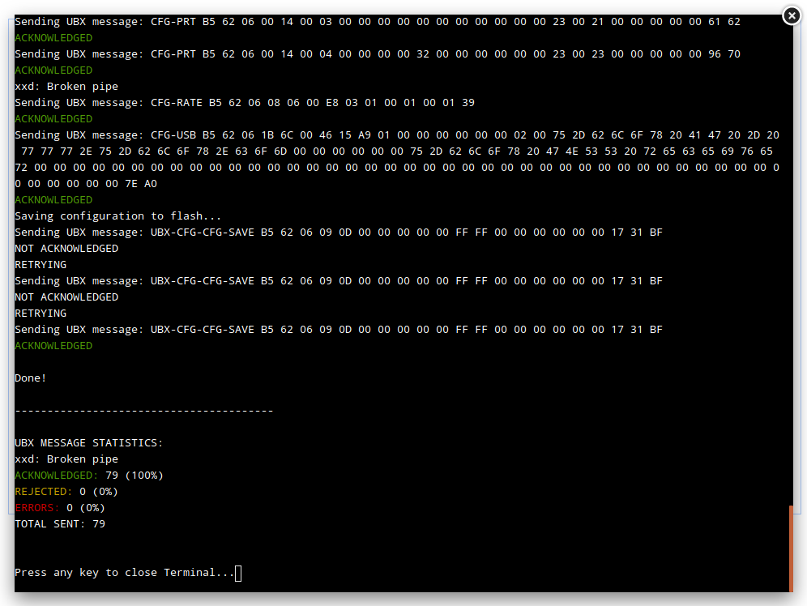

* Cliquer sur **```F2 > Reboot```** pour redémarrer le Raspberry pi , appuyer ensuite sur la croix (en haut à droite) pour sortir. Attendre que le rédemarrage s'effectue (env 1-2min) et frafraichir la page web (F5) pour accéder nde nouveau à l'interface.

### Personalisation de votre base RTK et positionnement approximatif

**Je rappel que la position de la base RTK est l'élément essentiel pour permettre ensuite un positionnement centimétrique et une répétabilité de ce positionnement, sans ça vous aurez une position centimétrique mais pas au bon endroit !!!**

Dans un premier temps nous allons donner une position approximative de l'antenne (en attendant le calcul précis) et définir son nom. Pour information, les paramètres par défaut de la position de la base est située sur le fort boyard ;) et son nom est BASE.

* éterminer une postion approximative
    * se rendre dans le dossier **```/rtkbase/rover/single/```** (positionnenement seulement le recepteur GNSS)
    * cliquer sur **```F2 > RTK Receiver ON```**
    * Taper **```status 1```**
    * au bout de quelques secondes vous aurrez une position comme ci dessous
    * cliquer sur **```ctrl c```** pour reprendre la main
    * taper **```shutdown```** pour arrêter l'aquisition

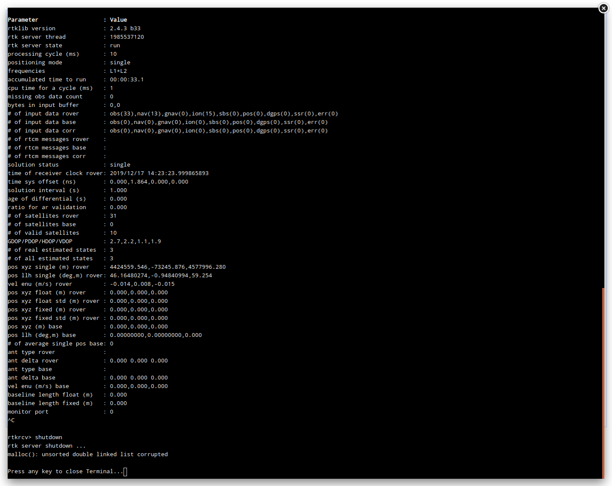

* Copier la valeur du status **```pos llh single (deg,m) rover: 00.00000000,-0.00000000,00.00```**

> ex: **```46.16480274,-0.94840994,59.254```**

* cliquer sur la croix pour sortir
* revenir à la racine **```./rtkbase```**
* Modifier les paramètres de position et le nom de la base dans le fichier **```./rtkbase/settings.conf```**. 
    * cliquer avec le bouton droit de la souris sur le fichier **```settings.conf```** **```> Edit```**
    * changer **```position='45.999381 -1.213787 50'```** par la position approximative de l'antenne récupérée précédement en changeant le **,** par un **espace**

> ex: **```46.16480274,-0.94840994,59.254```** vers **```position='46.16480274 -0.94840994 59.254'```**

    * changer **```mnt_name```** ex : **```mnt_name=FOOO```** C'est le nom de votre Base RTK, à vous de choisir 4-5 caractères en Majuscule.
    * faire un **```ctrl s```** pour enregistrer ou cliquer sur la **```X```** en haut à droite pour fermer et acceptez les modifications.

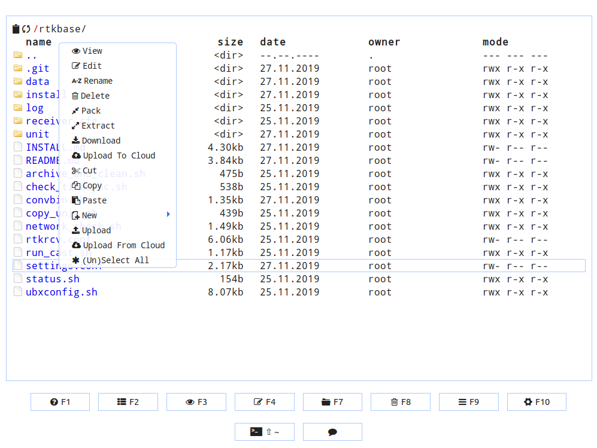
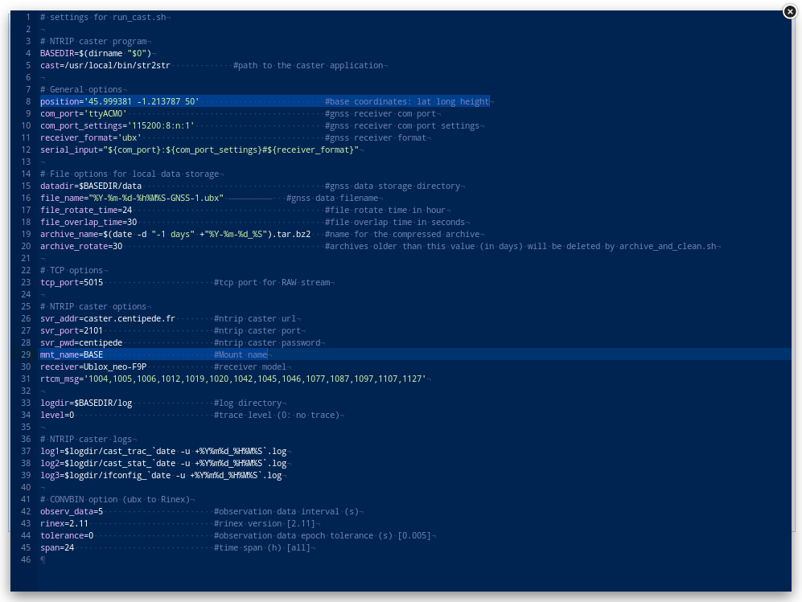

* Activer la nouvelle configuration: **```F2 > RTCM3 stop```** et **```F2 > RTCM3 start```**

### Gestion des logs pour le calcul précis de la position

* Aller dans le répertoire **```./rtkbase/data```** supprimer tous les fichiers.
* cliquer sur **```F2 > stop LOG```** et **```F2 > start LOG```**
* vérifier que 2 nouveaux fichiers sont de nouveaux disponibles

* Attendre 24h entières soit 1 journée complète (de 00:01:00 à 23:59:00). Par exemple, si vous démarrez vos logs le 18/12/2019 à 15h30 attendez jusqu'au 20/12/2019 matin.

> tous les jours à 04h du matin une compression des fichiers du jour précédent est effectuée ainsi que leurs conversion en fichier [RINEX](http://rgp.ign.fr/DONNEES/format/rinex.php)

* 24 h après, aller dans le répertoire **```./rtkbase/data```** et télécharger sur votre pc le dernier XXX-XX-XX-000000-GNSS-1-RINEX_XXXX-5s-24h.zip (clic droit > Download ). Archiver ce fichier afin de garantir et justifier votre calcul de postionnement si un administrateur du réseau Centipede le demande.

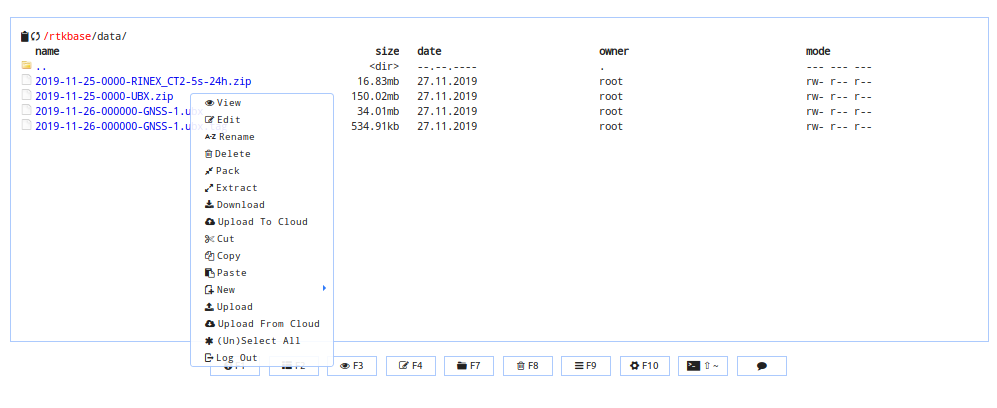

* Créer un répertoire ```./positionBaseRTK``` **sur votre PC** et décompresser le fichier téléchargé ( XXX-XX-XX-000000-GNSS-1-RINEX_XXXX-5s-24h.zip) dedans.

* Passer maintenant au [calcul du positionnement](./6_positionnement.md)

