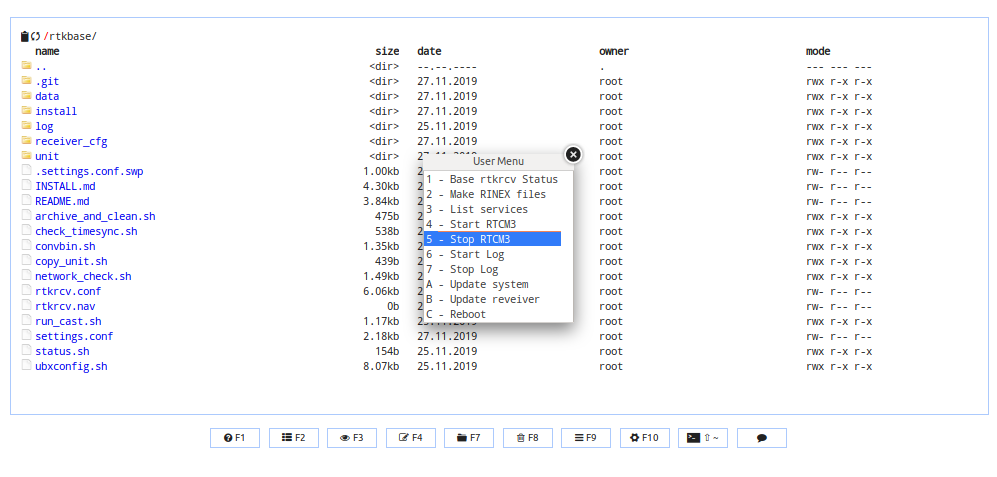
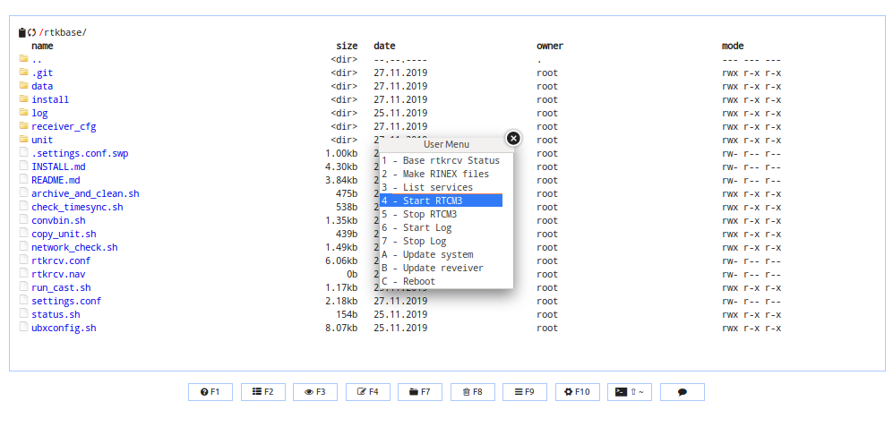
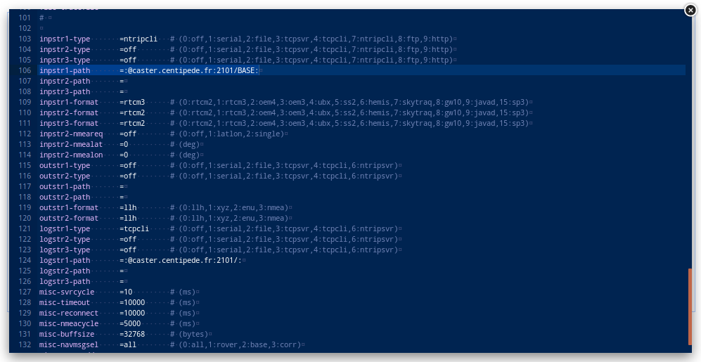
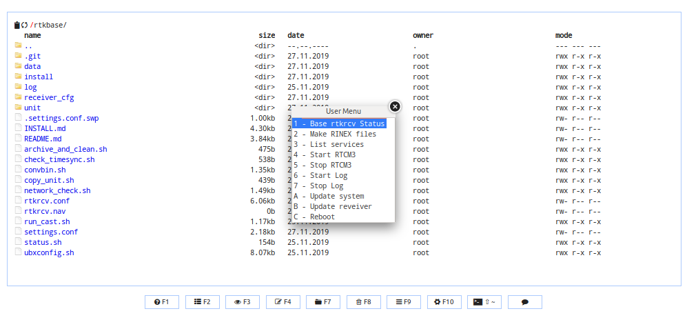
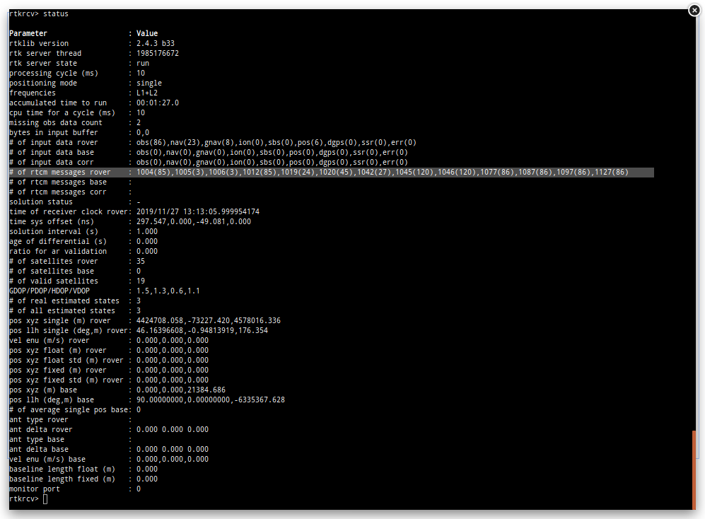

## 7 Déclaration

### mofifier la valeur de la posiotion dans la base RTK

* Revenir dans votre interface **http://centipede.local:8000**

* Modifier **```settings.conf```** et changer la position par celle calculée précedement **```position='46.164793681 -0.948418958 63.0686'```**

* Enregistrer **```ctrl s```** 

* lancer les commandes **```F2 > Stop Rtcm3```** & **```F2 > Start Rtcm3```** pour redemarrer le service avec la nouvelle configuration.




### Vérifier que la connexion avec le caster fonctionne

* Se rendre dans le dossier **```/rtkbase/rover/Test_Base2caster```**
* Clic droit sur le fichier `**```rtkrcv.conf```** > **```Edit```**
* Modifier la ligne 106 : **```:@caster.centipede.fr:2101/BASE:```** en changeant le nom de la base par la votre (attention concerver le **:** à la fin : **```@caster.centipede.fr:2101/FOOO:```**
* Enregistrer **```ctrl s```**



* Cliquez sur **```F2 > RTK reveiver OFF```** puis **```F2 > RTK reveiver ON```**



* Taper **```status 1```** Entrer & Vérifier que vous avez des valeurs sur la ligne **```# of rtcm messages rover: ```**

> ex : **```# of rtcm messages rover: 1004(43),1005(2),1006(2),1012(43),1019(19),1020(14),1042(8),1045(29),1046(29),1077(44),1087(44),1097(44),1127(44)```**

 

* Si l'étape précédente est OK alors votre base GNSS RTK fonctionne bien avec le [caster Centipede](http://caster.centipede.fr:2101).
* Pour sortir taper: **```shutdown```** 
* Enfin, envoyer un courriel à **contact@centipede.fr** pour activer votre base sur la [Carte](https://centipede.fr):
    * Nom Prénom
    * Profession
    * Courriel
    * Nom du point
    * Matériel utilisé.
