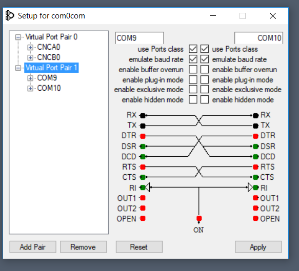
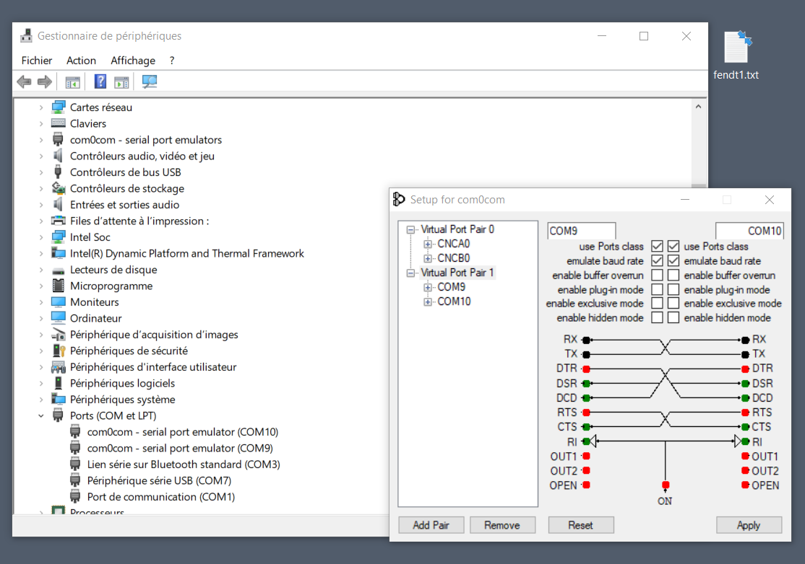
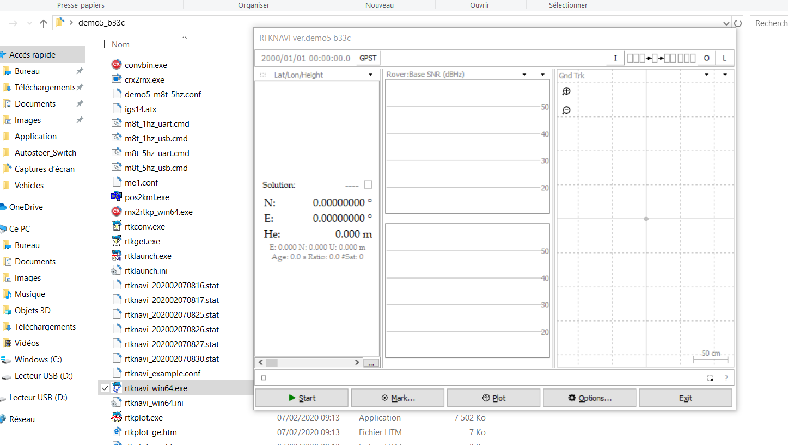
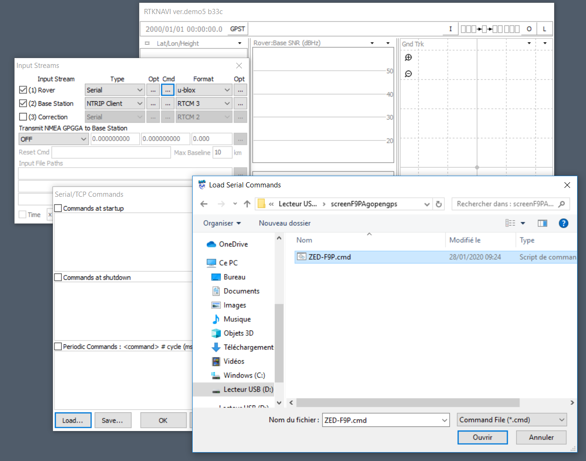
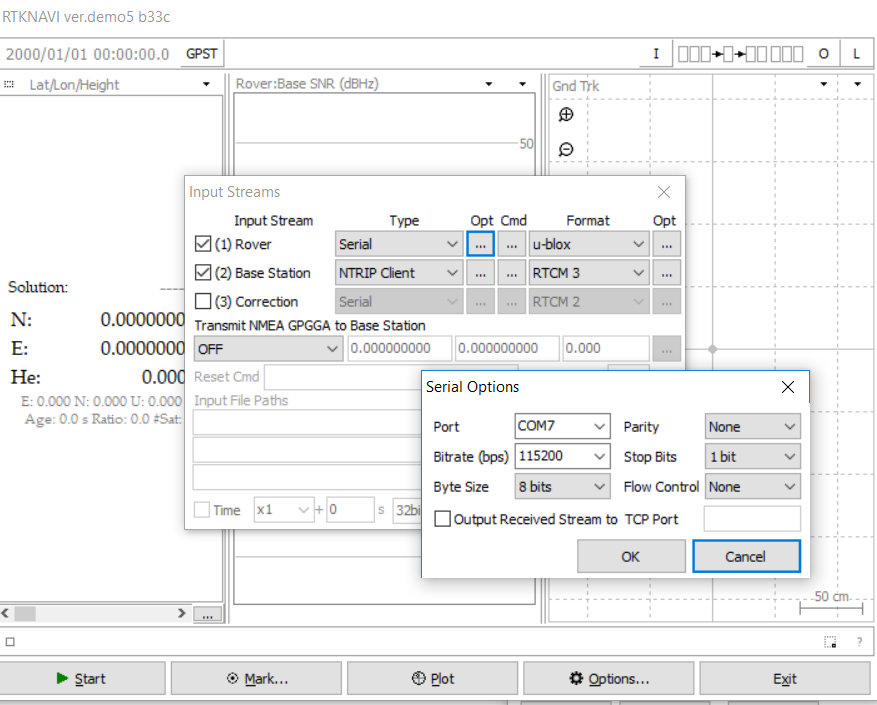
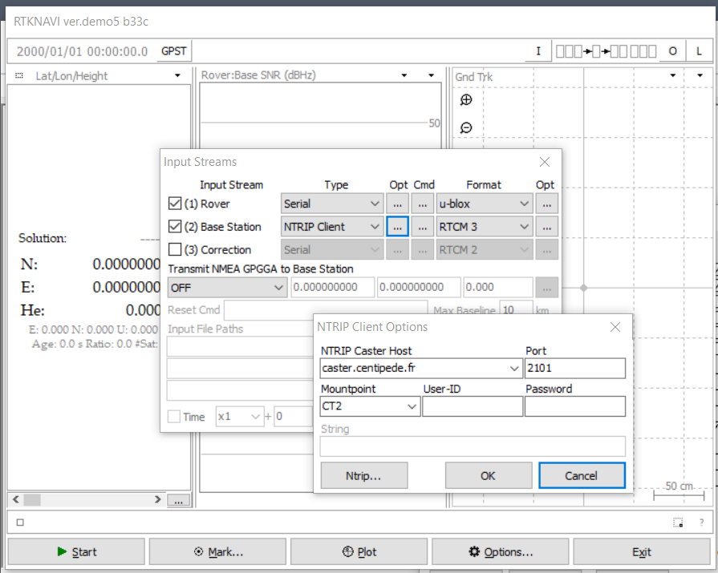
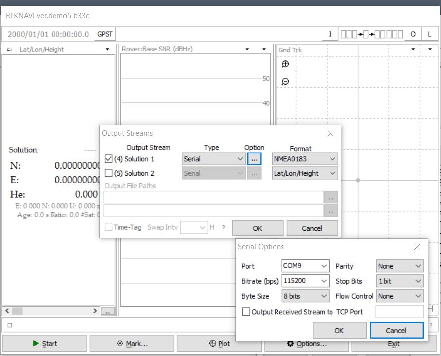
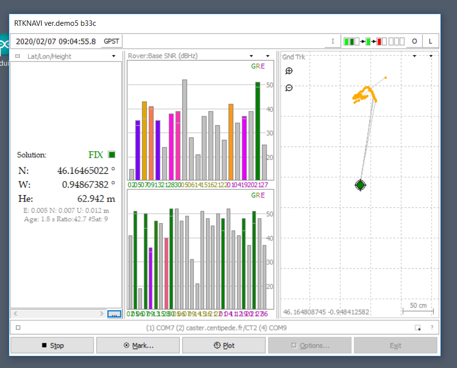
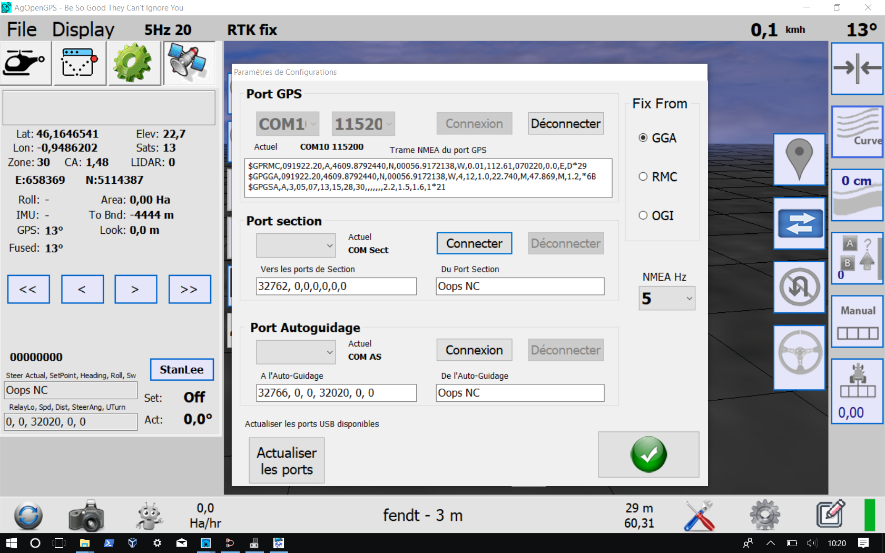

## 5.2 Utilisation Rover RTK sur PC Windows 

> Cette méthode est un exemple, il existe d'autres méthodes pour paramétrer un client Ntrip sous windows avec un récepteur F9P.
> L'objectif est d'intégrer les binaires Ublox plutôt que du NMEA, les paramètres du F9P sont quand à eux injectés à chaque lancement pour adapter facilement la configuration en fonction du travail à effectuer (Rate, Mask,DynModel,...). Le paramétrage est également plus fin afin d'avoir un FIX RTK rapide, stable et répétable.

**Toujours vérifier la disponibilité d'une base [Centipede](https://centipede.fr) avant de l'utiliser**

Pour l'utilisation sur le terrain, vous devez disposer d'un matériel compatible (antenne et récepteur) ainsi que d'une connexion Internet mobile (3-4-5G) pour la réception des trames de correction du caster [Centipede](https://centipede.fr)

### 5.2.1 Prérequis

#### Matériels

* Une tablette ou un PC sous windows 10

* Une [antenne GNSS bi-fréquence](https://store.drotek.com/da-910-multiband-gnss-antenna) ou bien la même chose chez un autre fournisseur [antenne GNSS bi-fréquence](https://www.ardusimple.com/product/simplertk2b/), d'autres modèles existent....

* Un [recepteur F9P](https://store.drotek.com/rtk-zed-f9p-gnss) ou bien la même chose chez un autre fournisseur [recepteur F9P](https://www.ardusimple.com/product/survey-gnss-multiband-antenna/), d'autres modèles existent....

* Un [câble antenne sma mâle tnc mâle 3m (longueur à adapter en fonction de votre projet)](https://www.mhzshop.com/shop/Cables-et-cordons/Sur-mesure/50-ohms-WiFi-4G/Cordon-sur-mesure-en-coax-faible-perte-WLL-240-2-4-5-GHz-6-1mm.html) dans le cas ou celui fournis avec l'antenne ne correspond pas à votre besoin.

#### Logiciels

* Le logiciel [Null-modem emulator](https://sourceforge.net/projects/com0com/files/latest/download) > création d'un virtual port COM pour utiliser les trames de géolocalisation NMEA corrigées en RTK comme un récepteur externe pour votre logiciel de collecte de donnée ou d'autoguidage.

* La dernière version du logiciel [RTKlib version Rtkexplorer demo5](http://rtkexplorer.com/downloads/rtklib-code/) > Calcul du postionnement en [RTK](https://fr.wikipedia.org/wiki/Cin%C3%A9matique_temps_r%C3%A9el) par [RTKlib](http://www.rtklib.com/) pour une géolocalisation centimétrique

* [AgOpenGps](https://github.com/farmerbriantee/AgOpenGPS) si vous souhaitez fabriquer votre propre autoguidage sur tracteur

### 5.2.2 Update du récepteur F9P

Le récepteur F9P n'a pas toujours son [firmware](https://fr.wikipedia.org/wiki/Firmware) à jour quand on le reçois, il est important de suivre cette procédure pour la suite:

* [Install U-center](https://www.u-blox.com/en/product/u-center) (Windows seulement)

* [Update F9P firmware](https://drotek.gitbook.io/rtk-f9p-positioning-solutions/tutorials/updating-zed-f9p-firmware)

### 5.2.3 Connexion et paramétrage

#### Paramétrage des ports COM et branchement de l'antenne GNSS

Il est necessaire d'installer un virtual port COM sur windows pour récupérer la trame NMEA corrigée sur ce dernier.

* télécharger [Null-modem emulator](https://sourceforge.net/projects/com0com/files/latest/download) et l'installer.

* Une fois insatller ouvrir le logiciel et vérifier les port ouvert, dans l'exemple **COM9** reçois les messages et **COM 10** diffuse le message (NMEA)

* Brancher l'antenne + recepteur F9P en USB

* Ouvrir ensuite le [gestionnaire de périphériques](https://support.microsoft.com/fr-fr/help/4026149/windows-open-device-manager) et vérifier les ports COM, dans l'exemple **COM9** et **COM10** comme precedemnet expliqué et **COM7** le recepteur F9P en USB.

> Reperez bien ces 3 Ports COM, il est indispensable de bien les identifier pour la suite du paramétrage en les adaptants à votre configuration, dans l'exemple:
> * **COM7**: Entrée USB de l'antenne GNSS
> * **COM9**: Sortie NMEA de RTKlib
> * **COM10**: Entrée NMEA pour AgOpenGPS ou de tout autre logiciel de géolocalisation
> Paramètres permanents. Il n'est pas necessaire de réouvrir ce programe dans lors des prochains démarrages du PC.

#### RTKLIB

> RTKLIB permet de conventir le Signal de postionnement de l'antenne GNSS grace à une correction RTCM3 (Réseau Centipede par exemple) en un signal de geolocalisation pécise au centimètre si les conditions le permettent.

* Télécharger la dernière version de [RTKlib version Rtkexplorer demo5](http://rtkexplorer.com/downloads/rtklib-code/)
* le décompresser dans le dossier de son choix.
* Ouvrir RTKNavi 

* Télécharger ce [fichier de paramétrage](https://github.com/jancelin/docs-centipedeRTK/blob/master/param_rtklib/AgOpenGps.conf)
* cliquer sur **option ...**
* Cick sur **LOAD** et choisir le dernier [fichier téléchargé](https://github.com/jancelin/docs-centipedeRTK/blob/master/param_rtklib/AgOpenGps.conf) et **OK**

> Permet de paramétrer automatiquement certains paramètres de RTkLIb

* Cliquer sur le **I** en haut à droite
* cliquer sur **ROVER** > **Opt**

* Modifier si besoin le Port **COM7** (Entrée USB de l'antenne GNSS) en fonction de votre paramétrage.
* Télécharger ce [fichier de paramétrage](https://github.com/jancelin/docs-centipedeRTK/blob/master/param_rtklib/ZED-F9P_AgOpenGps.cmd)
* cliquer sur **ROVER** > **Cmd**

* Cick sur **LOAD** et choisir le dernier [fichier téléchargé](https://github.com/jancelin/docs-centipedeRTK/blob/master/param_rtklib/ZED-F9P_AgOpenGps.cmd)
* Cocher **Commands at startup**

> Permet de charger des paramètres  injectés au module F9P à chaque démarage

* Ciquer sur **Base Staion** > **Opt**
* Modifier le Mountpoint sur la base [Centipede](https://centipede.fr) la plus proche de vous. 

> Si vous n'êtes pas couverts par une Base CentipedeRTK vous pouvez en fabriquer une [ici](https://jancelin.github.io/docs-centipedeRTK/3_Materiels.html).

* Cliquer sur le **O** en haut à droite
* cliquer sur **Solution** > **Option**
* Modifier si besoin le Port **COM9** (Sortie NMEA de RTKlib) en fonction de votre paramétrage.

* Faire **EXIT** et ré-ouvrir RTKNavi pour l'enregistrement des paramètres.

#### Premier démarage

* Clicker sur Start et attendre (de 30s à plusieurs minutes) une position **FIX RTK**

> L'antenne de réception doit biensur être en extérieur dans un milieu dégagé

* Si ce premier test apporte une solution en **FIX** passons à la suite.

### 5.2.4 Connexion pour [AgOpenGps](https://agopengps.discourse.group/)

* Ouvrir **AgOpenGPS** > **Paramères de configurations**

* Selectionner le Port GPS (Entrée NMEA pour AgOpenGPS dans l'exemple **COM10**) et la vitesse **115200**

* Ciquer sur **Connexion**

