## Utilisation

**Toujours vérifier [la disponibilité d'une antenne](https://centipede.fr) avant de l'utiliser**

Pour l'utilisation sur le terrain, vous devez disposer d'un matériel compatible (antenne et récepteur) ainsi que d'une connexion Internet mobile (3-4-5G) pour la réception des trames de correction du caster Centipede.

### Utiliser ce montage pour faire un rover

* Aller dans le dossier **```/rtkbase/rover```**
* Choisir le type de calcul de positionnement en se positionnant dans le bon répertoire:
  * **```/rtkbase/rover/Test_base2caster/```** : test pour voir si la base fonctionne bien avec le caster Centipede.
    * Modfier si besoin le fichier **```/rtkbase/rover/Test_base2caster/rtkrcv.conf```** ligne 107 et changer le nom du mountPoint par le votre **```inpstr2-path =:@caster.centipede.fr:2101/XXXX:```**
    * cliquer sur **```F2 > RTK Receiver ON```**
    * Taper **```status 1```** ou **```solution 1```**, **```help```**
  * **```/rtkbase/rover/kinematic_BT_nmea/```** : positionnement GNSS RTK et partage de postion (NMEA) via bluetooth
    * Modfier si besoin le fichier **```/rtkbase/rover/kinematic_BT_nmea/rtkrcv.conf```** ligne 107 et changer le nom du mountPoint par le votre **```inpstr2-path =:@caster.centipede.fr:2101/XXXX:```**
    * cliquer sur **```F2 > Start BT```** 
    * connecter votre smartphone ou pc sur le point Bluetooth **```centipede```** (avoir installé et paramètré préalablement sur android [cette appli](https://play.google.com/store/apps/details?id=de.mobilej.btgps&hl=fr) ou [celle là](https://play.google.com/store/apps/details?id=googoo.android.btgps&hl=fr))
    * cliquer sur **```F2 > RTK Receiver ON```**
    * vous pouver taper **```stream```** **```status 1```** ou **```solution 1```** pour verifier la connexion et ou le positionnement.
  * **```/rtkbase/rover/kinematic_TCP9000_nmea/```** : positionnement GNSS RTK et partage de postion (NMEA) via tcp sur le port 9000 http://centipede.local:9000
    * Modfier si besoin le fichier **```/rtkbase/rover/Test_base2caster/rtkrcv.conf```** ligne 107 et changer le nom du mountPoint par le votre **```inpstr2-path =:@caster.centipede.fr:2101/XXXX:```**
    * cliquer sur **```F2 > RTK Receiver ON```**
    * Taper si besoin **```status 1```** ou **```solution 1```**, **```help```**
    * la trame NMEA est accessible sur http://centipede.local:9000
  * **```/rtkbase/rover/single/```** : positionnenement par seulement le recepteur GNSS
    * cliquer sur **```F2 > RTK Receiver ON```**
    * Taper **```status 1```** ou **```solution 1```**, **```help```**
  * **```/rtkbase/rover/static_rtk/```** : Une solution qui vous permet de calculer, en RTK, la position de votre base (à quelques cm près) par rapport à une autre base RTK du réseau Centipède.
    * Modfier si besoin le fichier **```/rtkbase/rover/Test_base2caster/rtkrcv.conf```** ligne 107 et changer le nom du mountPoint par une base RTK situé à [proximité](https://centipede.fr) **```inpstr2-path =:@caster.centipede.fr:2101/XXXX:```**
    * cliquer sur **```F2 > RTK Receiver ON```**
    * Taper **```status 1```**
    * attendre d'avoir une **```solution status: fix```** et récupérer par un copier les valeurs **```pos llh single (deg,m) rover```** ex: **```45.99214415,-1.02822099,56.620 ```**
    * coller les valeurs (**en remplaçant les virgules par des espaces**) dans [**```/rtkbase/settings.conf```** pour définir la position de la base](https://github.com/jancelin/rtkbase/wiki/3.-Param%C3%A9trage#installation-initiale) en attendant un prochain [calcul de référence avec le RGP](https://github.com/jancelin/centipede/blob/master/docs/4_positionnement.md#43-r%C3%A9cup%C3%A9rer-les-donn%C3%A9es-du-rgp).
* **```CTRL c```**  pour arrêter le log de la commandes
* **```shutdown```** pour arrêter le service, si vous fermer juste la fenêtre le service tourne en tache de fond.
* cliquer sur **```F2 > RTK Receiver OFF```** pour arrêter tout les services RTK Receiver.


### Connexion au caster avec un matériel GNSS RTK lambda

Dans votre récepteur GNSS RTK:
  * Activer le ntrip Client + connexion mobile
  * Renseigner l'adresse du caster: ```caster.centipede.fr```
  * Son port de communication: ```2101```
  * Pas de login ni de mot de passe
  * Recharger la table des MountPoints
  * Selectionner votre base RTK (ex: CT2) ou la base la plus proche de vous, si vous êtes dans une [zone d'action](https://centipede.fr)


### Exemple avec une antenne [Sirius RTK GNSS ROVER](https://store.drotek.com/sirius-rtk-gnss-rover-f9p) + smartphone Android

 * Activer les données mobiles (pas de wifi)
 * Activer le [mode développeur](https://www.androidpit.fr/comment-activer-options-developpeurs-android) sur votre smartphone ou tablette android 
 * Installer l'application (payante) [Ublox Droid Center](https://play.google.com/store/apps/details?id=com.droid.acenter&hl=fr)
 * Connecter l'antenne [Sirius RTK GNSS ROVER](https://store.drotek.com/sirius-rtk-gnss-rover-f9p) au smartphone grâce à un adaptateur [Câble USB vers Micro USB](https://www.kubii.fr/cables-cordons-raspberry-pi/2275-cable-usb-vers-micro-usb-kubii-3272496011878.html?search_query=otg&results=5)
 * Activer la position fictive sur Android (paramètres > system > options pour développeurs) pour Ublox droid center

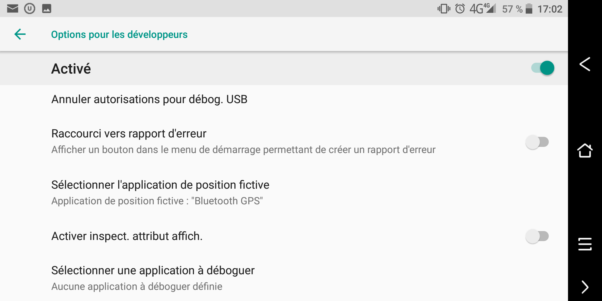
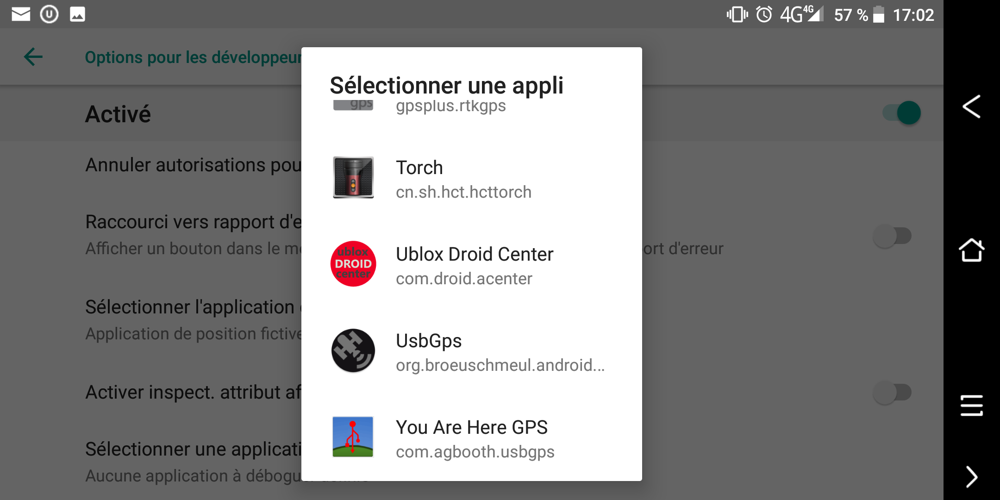

 * Lancer l'application Ublox Droid Center et cliquer sur **```open```**

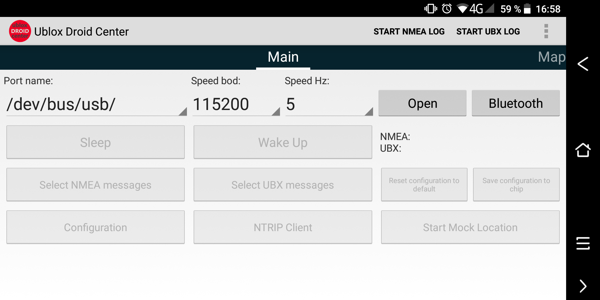

 * Autoriser l'application à accéder au périphérique USB

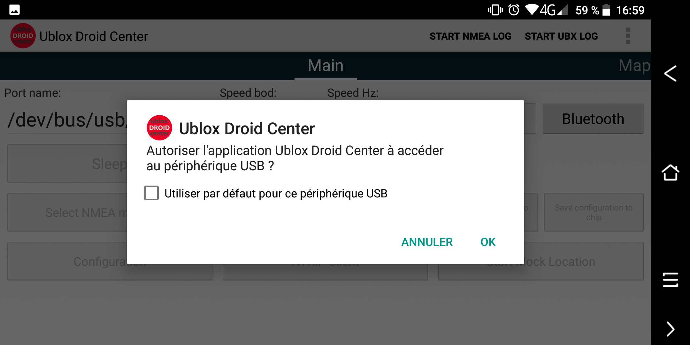

 * Cliquer sur **```Ntrip Client```** et renseigner **```Address```** et **```Port```** puis appuyer sur **```Get Mount Points```** pour récupérer la liste des bases RTK du réseau Centipede

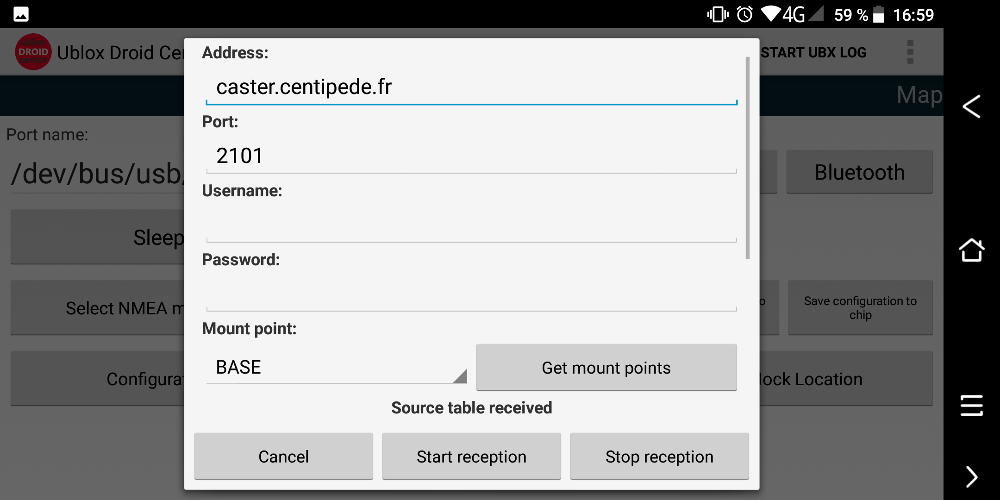

 * Choisir dans la liste la base RTK la plus proche (https://centipede.fr) et appuyer sur **```start reception```** puis **```cancel```** pour sortir

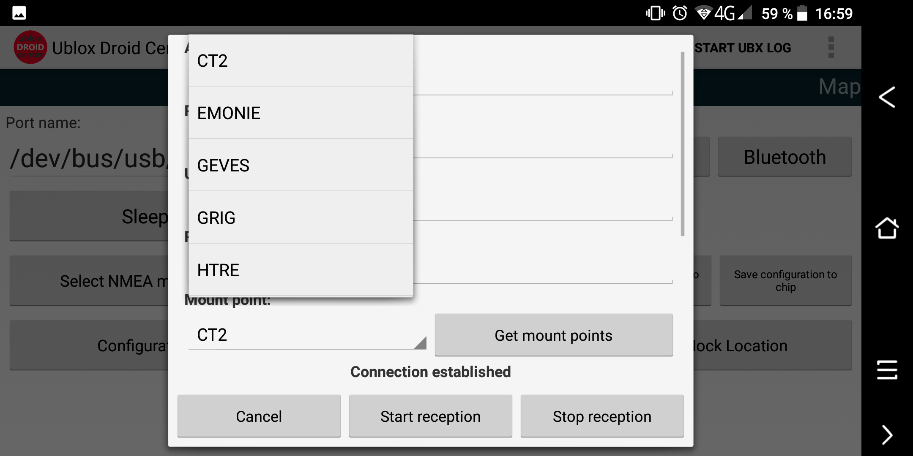

 * Appuyer sur **```Start Mock Location```** pour que votre positionnement passe par l'antenne RTK et non le GPS interne du smartphone. Ainsi, toutes vos applications de géolocalisation et d'acquisition de données utiliseront ce positionnement précis.

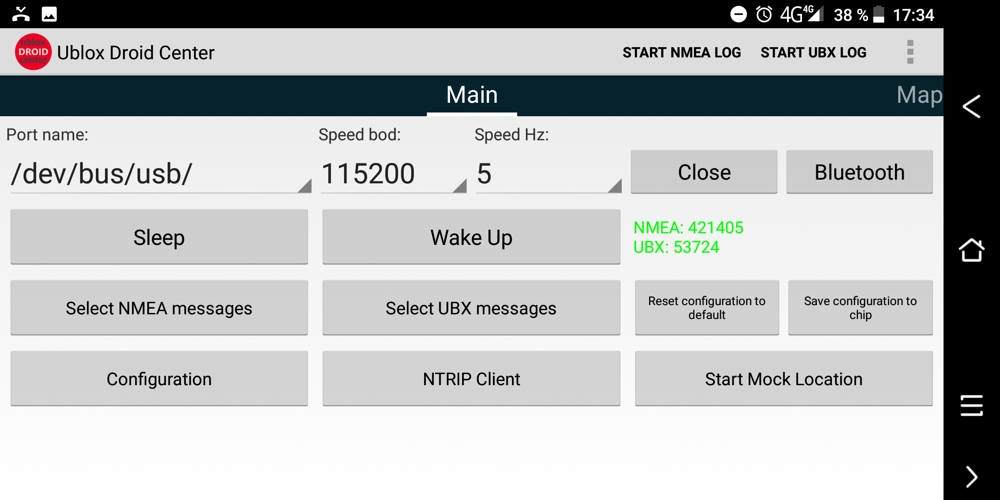

 * Après quelques secondes (jusqu'à 1 min) votre position est en RTKfix, vous avez donc une précision de quelques cm

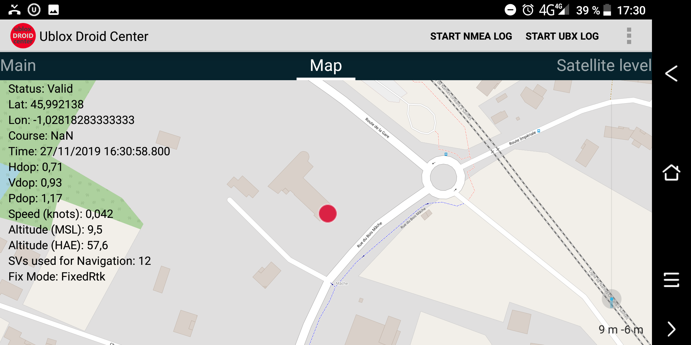


### Exemple avec une antenne [Emlid](https://store.emlid.com/) + smartphone android

* connecter votre Emlid Reach en wifi au Hotspot de votre téléphone (partage de copnnection wifi)

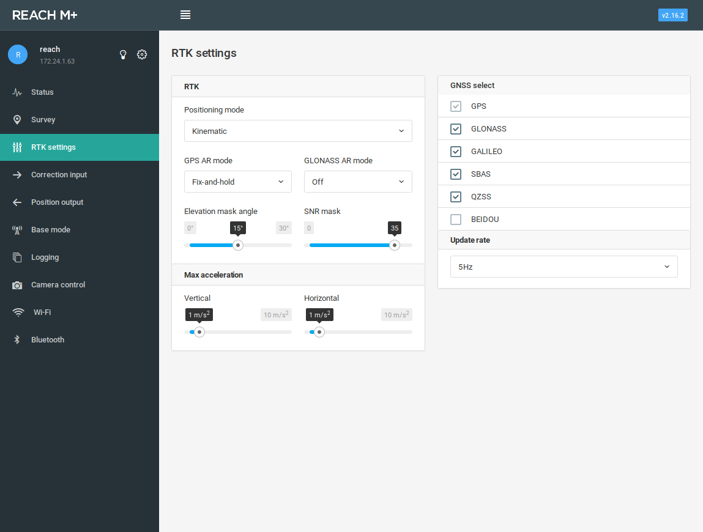

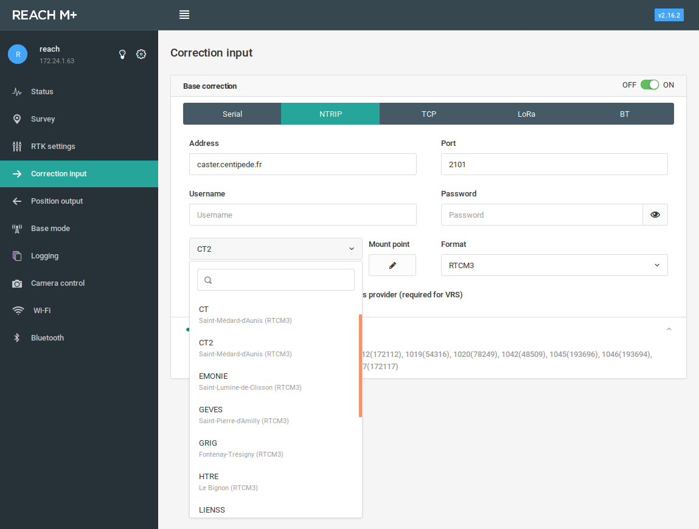

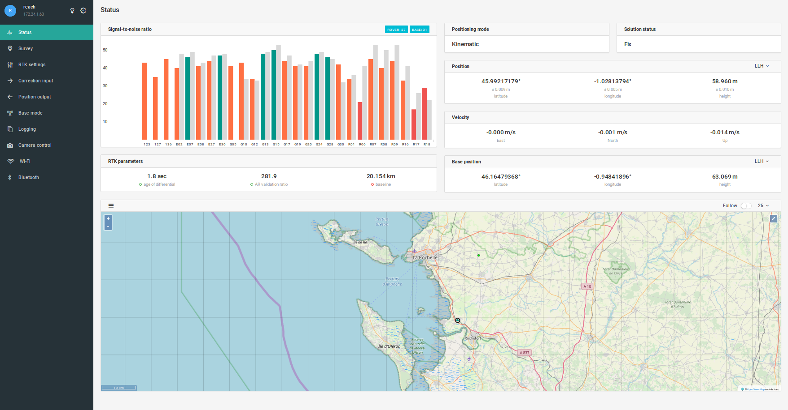

> https://docs.emlid.com/reachm-plus/


