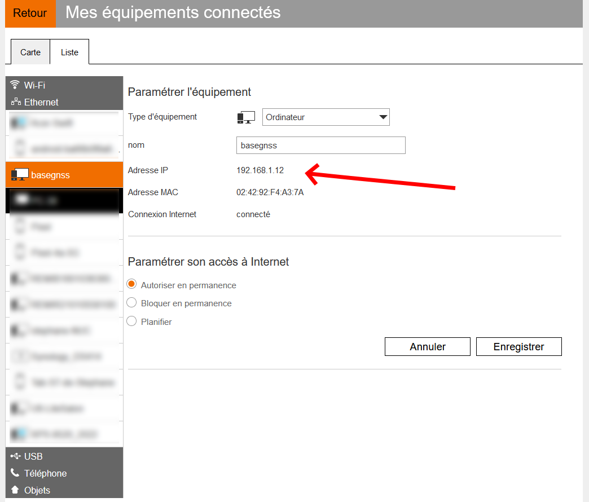
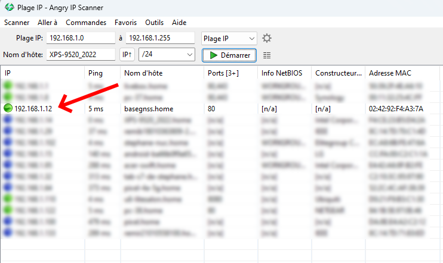
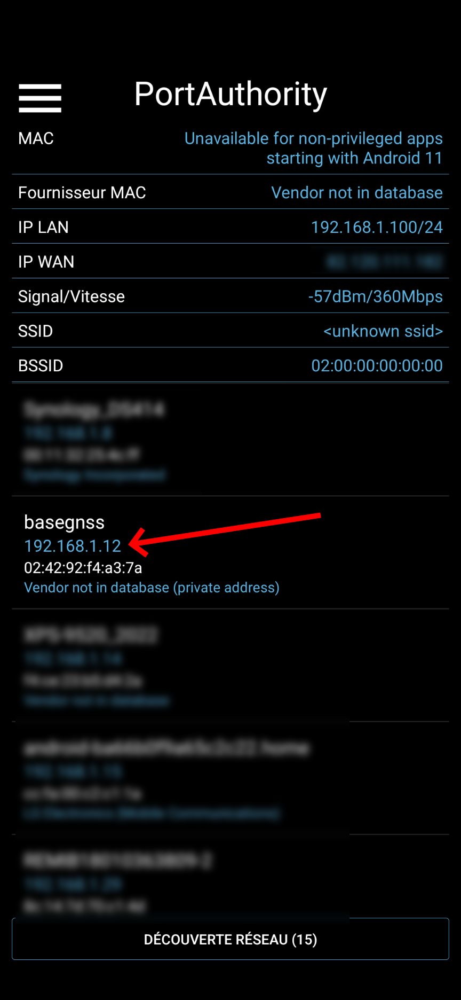

## Connexion
Pour se connecter sur la page Web de RTKBase, on utilise soit l'adresse `http://basegnss.local` dans un navigateur Web, soit si ça ne fonctionne pas, l'adresse IP de la carte. Cette adresse IP peut être retrouvée depuis l'interface de votre modem/routeur (livebox, freebox, etc) ou avec des outils tels que [Angry IP Scanner (windows)](https://angryip.org/) ou [Port Authority (Android)](https://play.google.com/store/apps/details?id=com.aaronjwood.portauthority.free&pli=1)).

|  |  | 

Sur les exemples ci-dessus, vous pouvez voir que la base utilise l'ip 192.168.1.12, donc dans la barre d'adresse du navigateur on peut entrer `http://192.168.1.12`  
Vous remarquerez que la base a vu son suffixe `.local` devenir `.home`. C'est la faute à la Livebox, ce sera peut-être différent chez vous.

Une fois arrivé sur la page de connexion, il suffit d'entrer le mot de passe par défaut (`admin`), qu'il est conseillé de modifier par la suite.

## Paramétrage

Maintenant nous allons nous occuper du premier paramétrage de la base.

RTKBase dispose de 3 onglets, **STATUS**, **SETTINGS** et **LOGS**. Commençons par aller sur l'onglet **SETTINGS** où il faut activer le "Main Service" s'il ne l'est pas déjà.
 Ensuite, allons sur l'onglet **STATUS** où vous devriez voir le niveau de réception des satellites, et après quelques secondes de calculs, la position approximative de la base, représentée par la puce bleu sur la carte, ainsi que les coordonnées enregistrées de la base représentées par la cible noire :

Tout va bien ? Si oui, alors direction l'onglet **SETTINGS**, et cliquons sur le bouton `Options` du service Ntrip. Le réglage important est celui du nom de la base, qu'on indique dans le champs "mount name". Ce nom est à choisir par vous-même, ne doit pas dépasser **4 caractères en majuscules**, ne pas être déjà utilisé par une autre base, et en évitant les noms de villes importantes (LYON serait une mauvaise idée).

**TODO Insérer lien vers le tableau des bases existantes**

Les autres options du service Ntrip doivent être les suivantes :
* **Caster address** : par défaut **caster.centipede.fr**
* **Caster port** : par défaut **2101**
* **Caster password** : Le mot de passe pour le caster centipède est **centipede**

Un clic sur le bouton `Save`, et c'est terminé.  

Non non ! On n'active pas le service Ntrip pour le moment, où alors on commencerait à envoyer un signal de correction avec des coordonnées fantaisistes.

En revanche, on active le `File Service`:

Ce service va enregistrer le signal de la base et créer une archive tous les jours à 4H00. Pour effectuer le calcul précis, il nous faut une archive contenant 24 heures d'enregistrement de 00H00 à 23H59. Donc, si nous sommes mardi, il faut patienter jusqu'à jeudi matin.

En attendant, vous pouvez aller lire les explications des différentes possibilités de RTKBase sur le [Guide de RTKBase](Guide_RTKBase).

Ca y est ? C'est jeudi ? Alors passons au calcul du [positionnement de la base](positionnement){: .btn }