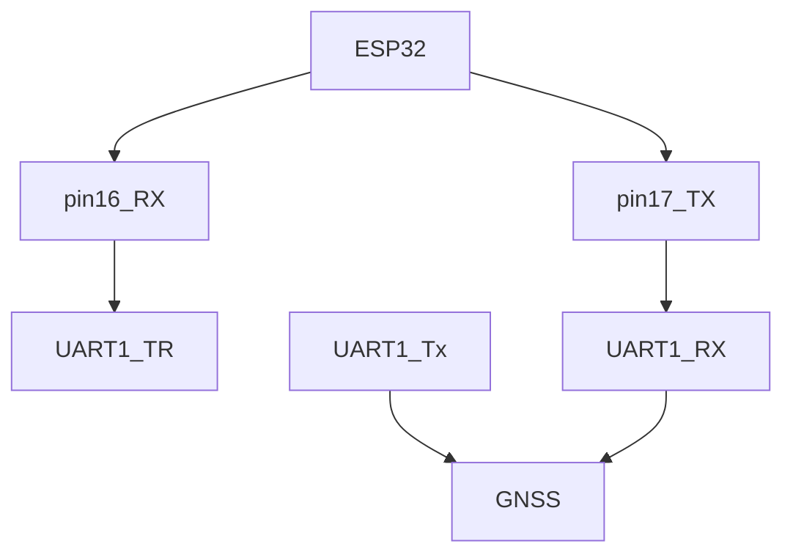

> En cours de développement/rédaction

### Matériel:

### Personnaliser son rover :

* Un rover Bluetooth : [esp32--android-BT](https://github.com/jancelin/rover-gnss/blob/master/unit_tests/8-BT/README.md){:target="_blank"}
* Un rover Bluetooth/UDP/serial avec NtripClient intégré: [esp32-wifi-ntrip](https://github.com/jancelin/rover-gnss/blob/master/unit_tests/3b-GNSS_RTK/README.md){:target="_blank"}

### Récepteurs GNSS compatibles:
