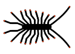
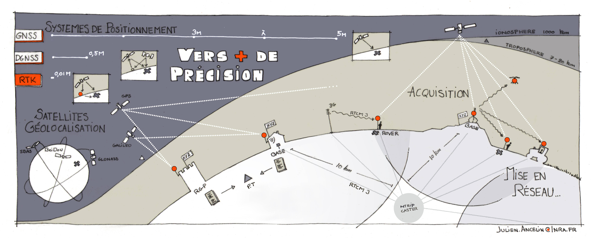

# Centipède

## Le Real Time Kinematic collaboratif, ouvert et Open Source  🛰️ 🛰️ 🛰️ 

Les instituts de recherche comme l’Inra et le CNRS utilisent la géolocalisation pour référencer leurs données environnementales, mais la précision des systèmes de navigation par satellite, qui dépend des conditions atmosphériques, n’est que de quelques mètres. Des systèmes de correction différentiels peuvent pallier ce manque de précision : le cinématique temps réel (Real Time Kinematic) permet ainsi d’approcher la précision centimétrique. Mais ce système nécessite une base de référence à proximité du lieu de collecte, l’accessibilité de son signal, un matériel et une location du signal extrêmement coûteux. Depuis quelques années, des développeurs travaillent d’arrache-pied avec les logiciels Opensource et l’Open Harware pour créer des solutions peu coûteuses, légères, faciles d’utilisation et fiables.

Le projet Centipède vise à créer un réseau de bases RTK ouvertes et disponibles pour toute personne se trouvant dans la zone de couverture. Le réseau, pourra également être complété et étendu par des particuliers, des privés ou partenaires publics.

Le projet est développé et coordonné par la plateforme DISA (CNRS/INRA) pour offrir à terme une couverture totale du territoire. Il est soutenu financièrement par la Région Nouvelle-Aquitaine et l'INRA et mutualise dès son démarrage en 2019 les moyens entre des instituts, des structures pubilques, des agrculteurs et des entreprises privés.

Cette technologie permet entre autres d’effectuer des relevés de haute précision géographique, d’accomplir des relevés photographiques grâce aux drones volants et d’automatiser la conduite haute précision des véhicules agricoles afin d’augmenter la précision, la qualité et la traçabilité des interventions.

Contact: contact@centipede.fr

<figure class="map">
  <iframe src="https://centipede.fr/index.php/view/map/?repository=centipede&project=centipede" width="100%" height="900" allowfullscreen="true"> </iframe>
</figure>

[https://centipede.fr](https://centipede.fr/index.php/view/map/?repository=centipede&project=centipede){:target="_blank"}

[http://caster.centipede.fr:2101](http://caster.centipede.fr:2101){:target="_blank"}

-------------------------------------------------------
